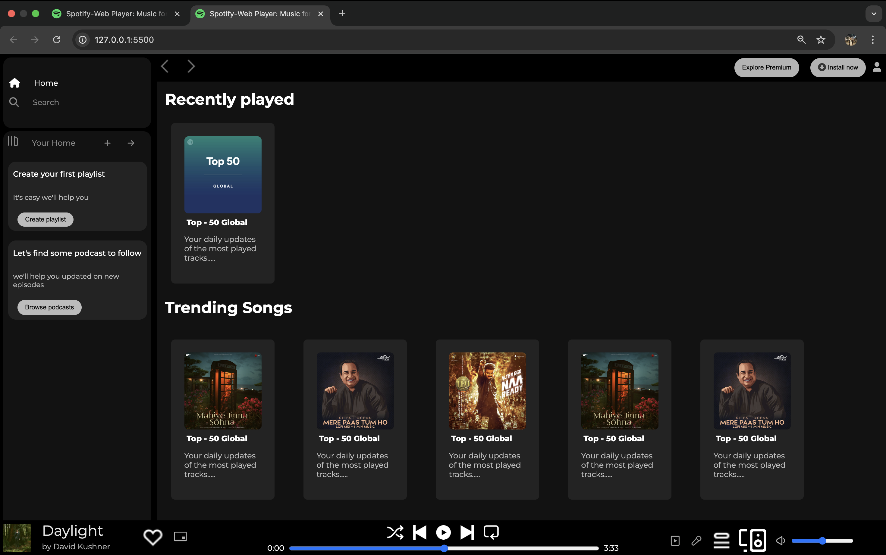

# Spotify Clone 🎧

This is a basic Spotify UI clone built using HTML and CSS. The project includes:

- Navigation bar
- Music player layout
- Aligned cards and sections
- Partial responsiveness (mobile view WIP)
- Images stored in `assets/` folder

## 🔗 Live Demo
[Click here to view it live](https://nextgencoder18.github.io/spotify-clone-Project-2/)

## 📸 Preview

## 📂 Technologies Used
- HTML5
- CSS3 (including some inline styles)

---

Made with ❤️ by Ronit Anant Nagose
